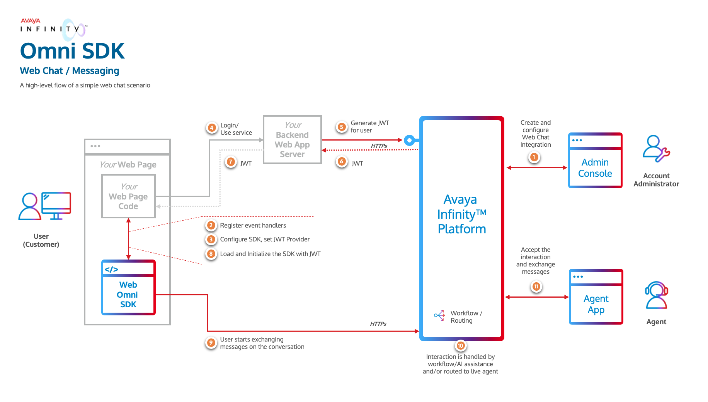

# Avaya Infinity™ Omni SDK

## Introduction

The Avaya Infinity™ platform provides the Omni SDK, which enables you to add the chat capabilities of the Avaya Infinity™ platform to your client applications. The Omni SDK is a set of libraries that provides APIs and UI components designed to facilitate the seamless integration of Avaya Infinity Omni channel functionalities into your client applications.

## Quick Start

To quickly get started with the Omni SDK and try out the web chat capabilities, get the necessary [Web Chat integration details and credentials](#details-required-for-web-chat-integration) from your account administrator, and follow these steps:

1. Run the **Sample Backend Web App**
   - Clone or download the **Sample Backend Web App** repository from [GitHub](https://github.com/Avaya-Infinity/omni-sdk-starter-kit).
   - Configure the **Sample Backend Web App** with the necessary Avaya Infinity™ credentials and settings and run the Node.js server. Refer the instructions in the [README](https://github.com/Avaya-Infinity/omni-sdk-starter-kit/tree/main/sample-web-app-server).
2. Run the **Sample Messaging Client Application**
   - Clone or download the Omni SDK Web repository from [GitHub](https://github.com/Avaya-Infinity/omni-sdk-web).
   - Configure the **Sample Messaging Client Application** with the necessary Avaya Infinity™ settings and the **Sample Backend Web App** details. Build and run the Node.js application. Refer the instructions in the [README](sample-app-messaging).
3. Launch the **Sample Messaging Client Application** in a web browser and start a chat conversation.

## Next Steps

1. Review the key components and integration flow involved to achieve Omni SDK integration in the [Overview](#overview) section.
2. Reach out to your Avaya Infinity™ account administrator to obtain appropriate [access information for a Web Chat integration](#details-required-for-web-chat-integration).
3. Refer to these supporting artifacts:
   - [Omni SDK API documentation](https://avaya-infinity.github.io/omni-sdk-web/)
   - [Sample Web Chat Client Application](./sample-app-messaging/)
   - [Sample Backend Server](https://github.com/Avaya-Infinity/omni-sdk-starter-kit)
4. Integrate your client applications with Avaya Omni SDK to enable web chat capabilities.

### Details Required for Web Chat Integration

To integrate your client application with Avaya Infinity™ Omni SDK for web chat capabilities, you need to gather some essential details and credentials. Reach out to your Avaya Infinity™ account administrator to obtain the following information:

- For your Backend Web App (To generate JWT):

  - Avaya Infinity™ hostname
  - Account Id
  - Web Chat Integration Id
  - Client Id
  - Client Secret

- For using the Omni SDK:

  - Avaya Infinity™ hostname
  - Web Chat Integration Id
  - URL of your Backend Web App Service (to fetch JWT)

## Overview

Integration with Avaya Infinity™ Omni SDK requires the following steps at a high level:

- Provision a [Web Chat Integration](#provision-a-web-chat-integration)
- Understand how to enable your Backend Web App Service to [authorize each end user](#authorization) using your Client Application to access Avaya Infinity™ capabilities.
- Integrate your Client Application with [Omni SDK](#using-the-omni-sdk) to use Avaya Infinity™ capabilities.

The below image gives an overview of a high level flow of how these all the  components work together to form the solution.

## Provision a Web Chat Integration

Your Account Administrator must first create a Web Chat integration for the Omni SDK using the Avaya Infinity™ admin console. An Integration represents the entry point for conversations initiated through your client applications meant for a business function. Multiple Integrations can be created in an Avaya Infinity™ Account to represent various business functions. Various configurations can be set on each Integration to control the behavior of the conversations initiated through it, like:

- Routing details for the conversation (workflows and queues).
- Attachment types and size limits allowed for the customer to send.
- Look and feel of the chat widget including the colors and window title text.
- Canned messages that the SDK can display to the customer before the customer sends any message.
- Enable or disable various buttons that appear on the chat widget.

Each Web Chat Integration is identified by a unique `integrationId`. Your Account Administrator should be able to provide you with the `integrationId` of the Web Chat Integration created for your client application.

When the Omni SDK is loaded and initialized by your client application, it will load the configuration of the Web Chat Integration configured by your Account Administrator and behave accordingly. Hence it is important that the `integrationId` is correct and the Web Chat Integration is configured properly to meet your business requirements.

## Authorization

The Omni SDK requires a JSON Web Token (JWT) to connect to Avaya Infinity™ services. A unique token must be generated for each end user (your customers). Since your backend web application is aware of the user using your services, it should securely fetch the token from Avaya Infinity™ for the user whenever your application requires it.

In order to fetch the JWT from Avaya Infinity™, your backend web application server needs to call the [Generate JWT API](https://github.com/Avaya-Infinity/omni-sdk-web/blob/main/generate-jwt-api.md) with the required parameters. The API will return a new JWT that your client application must provide it to the Omni SDK while loading, initializing and whenever the JWT expires.

> [!Important]
> Ensure your backend web application does not expose the clientId and secret required to call the [Generate JWT API](https://github.com/Avaya-Infinity/omni-sdk-web/blob/main/generate-jwt-api.md) to your client applications, which is the main reason why the JWT is fetched by your backend web application server. If the clientId and secret are exposed to the end user's device, they could be misused.

## Sample Backend Web Application Server

To help you add the JWT fetching mechanism into your backend web application server, you can refer the code of [sample backend web application](https://github.com/Avaya-Infinity/omni-sdk-starter-kit). You can also run this Node.js application (after providing some basic configuration) to quickly test fetching JWTs for your Client Application. Note that this is just a sample application and not meant to be directly used in production.

## Using the Omni SDK

Once your backend web application is ready, you can add the Omni SDK to your client application. The Omni SDK is modular and consists of three main modules namely Core, Messaging, and Messaging UI. These modules can be used independently or together based on your requirements.

### Core

Provides the basic functionality to establish session with Avaya Infinity™ platform, start and end a conversation for the user along with providing other related utilities. This module is a prerequisite for using any of the other modules. Detailed documentation for the Core module is available [here](./core.md).

### Messaging

Provides capability to send messages and listen to events occurring on the conversation. This module is dependent on the [Core](#core) module. More details about the Messaging module can be found [here](./messaging.md).

### Messaging UI

Provides a built-in Messaging UI component to view the messages exchanged on the conversation and send messages or attachments. The module is dependent on [Core](#core) and [Messaging](#messaging) modules. The look and feel of the Messaging UI component is highly customizable so that you can blend it with your application’s theme. It takes care of rendering the rich media action buttons and sending the respective response from the user. Using this module is the quickest and easiest way to add Avaya Infinity™ Web Chat capabilities into your client application. More details about the Messaging UI module can be found [here](./messaging-ui.md).

## Combining the Modules

Each module is packaged as a separate library. You can select the modules that are necessary to meet your business requirements and include them exclusively into your client application.

### Use Cases

- **Use the Avaya Infinity™ Built-in Messaging UI**

  If you need to simply add the Avaya Infinity™ Web Chat capabilities to your client application, the easiest way is to use the built-in Messaging UI provided by our Omni SDK. In this case, you need to include the **[Messaging UI](#messaging-ui)** module. It will automatically include the **[Core](#core)** and **[Messaging](#messaging)** modules as dependencies.

- **Integrate Avaya Infinity™ Omni SDK with your own chat UI**

  If you want to integrate your own Chat UI with Avaya Infinity™, you need to include the **[Messaging](#messaging)** module, which will automatically include the **[Core](#core)** module as a dependency.

## License

View [LICENSE](https://support.avaya.com/css/public/documents/101038288)

## Changelog

View [CHANGELOG.md](./CHANGELOG.md)
