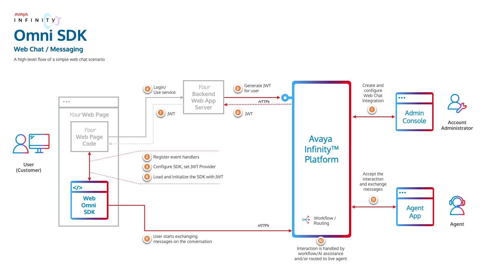
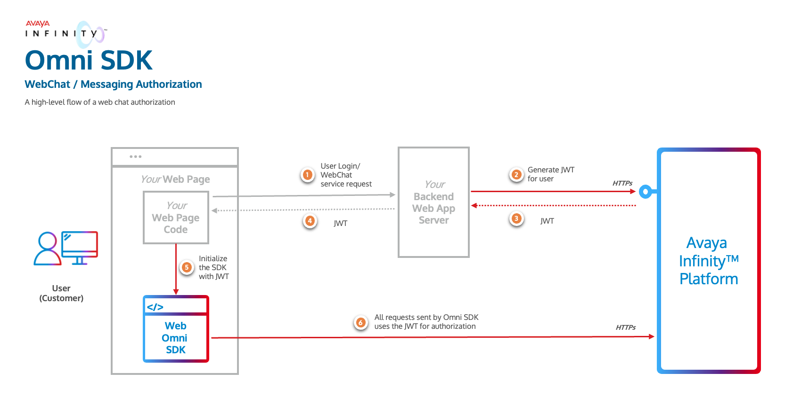

# Avaya Infinity™ Omni SDK

## Introduction

Avaya Infinity™ platform provides Omni SDK using which you can enable your client applications with messaging and call capabilities of Avaya Infinity™ platform. The Omni SDK is a set of libraries that provide a collection of methods, objects, events and UI components that will allow you to easily integrate your client applications.

## Next Steps

1. Review the key components and integration flow involved to acheive Omni SDK integration in the [Overview](#overview) section.
2. Reach out to your Avaya Infinity™ account administrator to obtain appropriate access information for a Web Chat integration, like,

   - for your Backend Web App (To generate JWT):
  
     - Avaya Infinity™ hostname
     - Account Id
     - Web Chat Integration Id
     - Client Id
     - Client Secret

   - for use the Omni SDK:

     - Avaya Infinity™ hostname
     - WebChat Integration Id

3. Download the Omni SDK and supporting artifacts like [SDK documentation](../docs/index.html), [sample client application](../sample-app-messaging/), and [reference backend server](https://github.com/Avaya-Infinity/omni-sdk-starter-kit).
4. Integrate your client applications with Avaya Omni SDK to enable web chat capabilities.

## Overview

Integration with Avaya Infinity™ Omni SDK requires the following steps at a high level:

- Provision a [Web Chat Integration](#provision-a-web-chat-integration)
- Understand how to enable your Backend Web App Service to [authorize each end client](#authorization) using your Client Application to access Avaya Infinity™ capabilities
- Integrate your Client Application with [Omni SDK](#using-the-omni-sdk) to use Avaya Infinity™ capabilities.

The below image gives an overview of a high level flow of how these all the  components work together to form the solution.



## Provision a Web Chat Integration

Your Account Administrator must first create a Web Chat integration for the Omni SDK using the Avaya Infinity™ admin console. An Integration represents the entry point for conversations initiated through your client applications meant for a business function. Multiple Integrations can be created in an Avaya Infinity™ Account to represent various business functions. Various configurations can be set on each Integration to control the behavior of the conversations initiated through it, like,

- routing details for the conversation (workflows and queues)
- attachment types and size limits allowed for the customer to send
- the look and feel of the chat widget including the colors and window title text
- the canned messages that the SDK can display to the customer before the customer sends any message.
- enable or disable various buttons that appear on the messaging widget

Each Web Chat Integration is identified by a unique `integrationId`. Your Account Administrator should be able to provide you with the `integrationId` of the Web Chat Integration created for your client application.

When the Omni SDK is loaded and initialized by your client application, it will load the configuration of the Web Chat Integration configured by your Account Administrator and behave accordingly. Hence it is important that the `integrationId` is correct and the Web Chat Integration is configured properly to meet your business requirements.

## Authorization

The Omni SDK requires a JSON Web Token (JWT) to connect to Avaya Infinity™ services. A unique token must be generated for each end user (your customers). Since your backend web application is aware of the user using your services, it should securely fetch the token from Avaya Infinity™ for the user whenever your application requires it.



In order to fetch the JWT from Avaya Infinity™, your backend web application server needs to invoke the following API:

```
https://<avaya-infinity-hostname>/auth/realms/avaya/protocol/openid-connect/token
```

Users using your web application services can be categorized into verified (authenticated or logged-in) and unverified (guest) users.

While invoking the API to generate the JWT, the backend web application can specify if the token is being generated for a verified user by setting `verifiedCustomer` to `true`. For verified users, the backend web application must set the `customerId` to a value it uses to identify or trace the user so that Avaya Infinity™ is also able the trace multiple sessions of the same user. It should also pass valid information in the `customerIdentifiers` field so that Avaya Infinity™ is able to build the Customer Journey across multiple channels.

For unverified users, if the backend application does not have any id for the user, it can set the `customerId` to a random Id as `customerIdentifiers` are anyways ignored for unverified users.

The JWT is short lived and expires after 15 minutes (by default, expiry time can be set between 15 to 60 minutes while your Backend Web App server requests to create the JWT). Your client application must implement the `JwtProvider` interface of the Omni SDK. The 'fetchJwt()' method of this interface will be invoked by the Omni SDK 3 minutes before the token is about to expire so that your application can request your backend web application for a new token and return it back to the Omni SDK.

## Sample Backend Web Application Server

To help you change your backend web application server to fetch JWT for your client applications, a sample backend web application is available for reference [here](https://github.com/AvayaExperiencePlatform/omni-sdk-starter-kit/tree/master/%20%20sample-web-app-server). You can also run this Node.js application (after providing some basic configuration) to quickly test fetching JWTs for your Client Application. Note that this is just a sample application and not meant to be directly used in production.

## Using the Omni SDK

Once you have implemented the `JwtProvider` interface to fetch the JWT from your backend web application service, you must configure the Omni SDK the JWT and provide the required parameters like `region`, `integrationId`, instance of the implementation of `JwtProvider`, `appKey`, etc. Once the Omni SDK is configured successfully, you can retrieve the default Conversation for the user that gets automatically created on Avaya Infinity™. The user can exchange messages and make calls on this Conversation. The default conversation of the user never ends and currently the only conversation user can use. If the user accesses your application from multiple devices and the same `customerId` is used while generating the JWT, the user will be able to view and resume the same default conversation from any of the devices.

The Omni SDK contains the following modules:

### Core

Provides the basic functionality to configure the Omni SDK and retrieve the default conversation of the user. Core establishes the session with Avaya Infinity™ for the end user.

### Messaging

Provides capability to send messages and listen to participant and message events on the conversation. This module is dependent on the Core module.

### Messaging UI

Provides a built-in Messaging UI component to view the messages exchanged on the conversation and send messages or attachments. The module is dependent on Messaging and Core modules. The look and feel of the Messaging UI component is completely customizable so that you can blend it with your application’s theme. It takes cares of rendering all supported rich media types including sending responses when action buttons part of the rich media messages are pressed by the user. Using this module is the quickest and easiest way to enable your application with all messaging capabilities.

## Combining the Modules

Each module is packaged as a separate library. You can select the modules that are necessary to meet your business requirements and include them exclusively into your client application. Since every module depends on the Core module, using any of the modules will need having the Core module included, either implicitly or explicitly.

Here are a few examples of scenarios:

- **Message Only Integration (with Built-in UI)**

  If your client application only needs to AXP Messaging capabilities, you need to include the following modules:
  - **Core** module
  - **Messaging** module
  - **Messaging UI** module

- **Message Only Integration (without Built-in UI)**

  If you do not want to leverage the built-in Messaging UI provided by our Omni SDK, but only want to leverage the AXP Messaging using you own UI, you need to include the following modules:
  - **Core** module
  - **Messaging** module

The following sections will help you get started on integrating your Android, iOS or Web Client Applications with Avaya Infinity™ Omni SDK

[Android SDK](doc:omni-android-sdk)

[iOS SDK](doc:omni-ios-sdk)

[Web SDK](doc:omni-web-sdk)